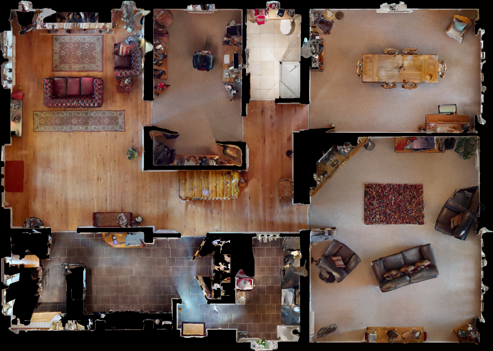

# CollectHabitatMap
It provides RGB/Semantic(Instance, Region, Place) Top Down Map for Habitat-Sim.
The position on the map can be converted to the position in the habitat-sim scene (vice versa).

## Example Output
* RGB Top Down Map  

* Instance Top Down Map  

* Region Top Down Map  

* Place Top Down Map  

## Download
You can download the generated top down maps [Here]().

## Play with Map
After collecting the map, play with it using play_with_2dmap.py

### Usage
* You can use 'w/a/s/d' buttons to move an agent in the simulator.
* Double click the map and press 'm' to move to the clicked position.
* Press 'n' to move random point in the map.
* Press 'v' to see next house.