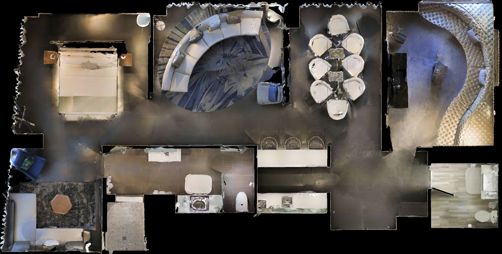
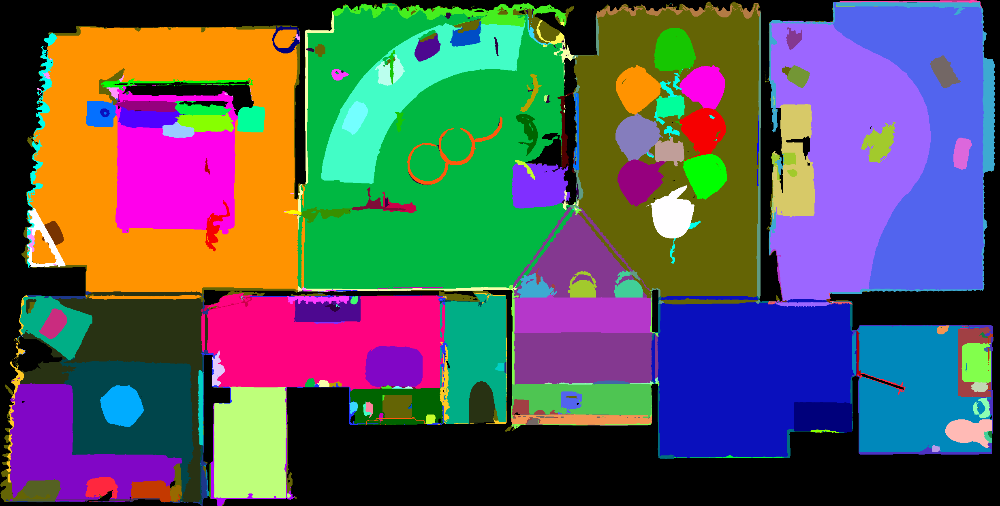
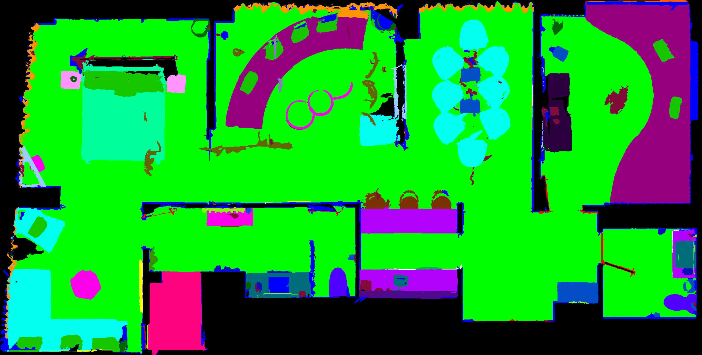
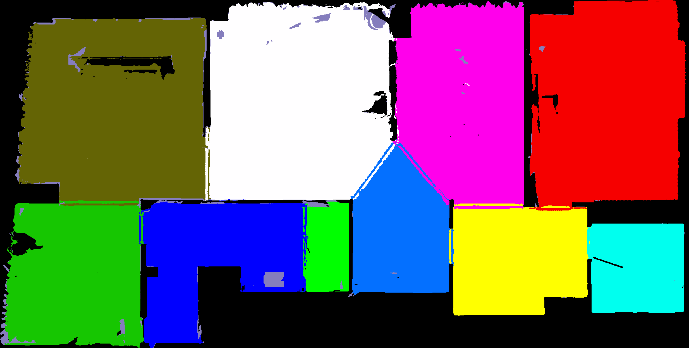
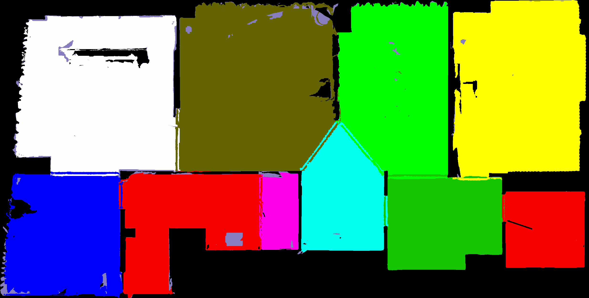

# Object2HabitatMap
It provides RGB/Semantic(Instance, Category, Region, Place) Top Down Maps for Habitat-Sim. 
The position on the map can be converted to the position in the habitat-sim scene (vice versa). 
After collecting maps, add objects using the maps with add_object_with_2dmap.py

## Note
gibson, mp3d, and gibson_tiny datasets are collected using habitat 0.2.1.  
hm3d dataset is collected using habitat 0.2.2.

## Examples

* See how to add objects using the maps. 

* RGB Top Down Map  

* Instance Top Down Map  

* Category Top Down Map  

* Region Top Down Map  

* Place Top Down Map  

## Download
You can download the generated top down maps [Here](https://mysnu-my.sharepoint.com/:f:/g/personal/blackfoot_seoul_ac_kr/EvtGmk7nR2xIl6ddsOQXP4oBguEAJm5yt3WrMl8Cv4ZUaw?e=WNxYIs)
and object data [Here](https://mysnu-my.sharepoint.com/:f:/g/personal/blackfoot_seoul_ac_kr/EnlMQwuYCyhIlaUR5ibGzEIBaYXL2_Krf7X_L_XI8nb8Xg?e=whL9BI).  
The objects are adapted to habitat from [ShapeNetCore](https://shapenet.org/).

## Play with Map
After collecting the map, play with it using play_with_2dmap.py

### Usage
* You can use 'w/a/s/d' buttons to move an agent in the simulator.
* Double click the map and press 'm' to move to the clicked position.
* Press 'n' to move random point in the map.
* Press 'v' to see next house.

## Add Objects on Environments
### Usage
* Use "manual" command to manually add objects on the map.
* Otherwise, the code will automatically add objects on the environment.
* Double click the map and press 'm' to move to the clicked position.
* Press 'n' to move random point in the map.
* Press '8' to see prev house.
* Press '9' to see next house.
* Press 'a' to add an object to the clicked position.
* Press 'z' to remove the recently added object.
* Press 'c' to remove all the objects.
* Press 's' to save the added objects.
* Press 'l' to load the objects from file.
* Press 'q' to quit.
* Press 'h' to see the help.
* You can change the object rotation by pressing '0 - = p [ ]' buttons.
* You can change the object position by pressing 'l ; ', . / ' buttons.
