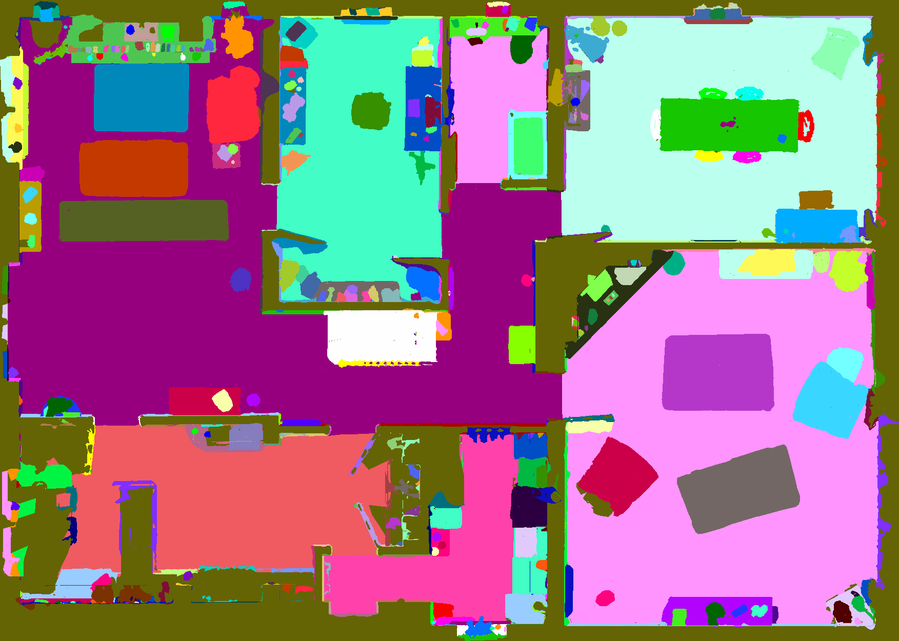

# CollectHabitatMap
It provides RGB/Semantic Top Down Map for Habitat-Sim.
Note that depth map is not supported yet.

## Example Output

## Download
You can download the generated top down maps [Here](https://mysnu-my.sharepoint.com/:u:/g/personal/blackfoot_seoul_ac_kr/EfMyJQK64a1Fnb3iEBJDd8cBhJvTeRpEMvZRA8YsJdESyA?e=7Y3yiq).

## Play with Map
After collecting the map, play with it using play_with_2dmap.py
You can use 'w/a/s/d' buttons to move an agent and double click the map and press 'm' button to move to the clicked position.
Click 'n' button to move random point in the map.
Click 'v' button to see next house.